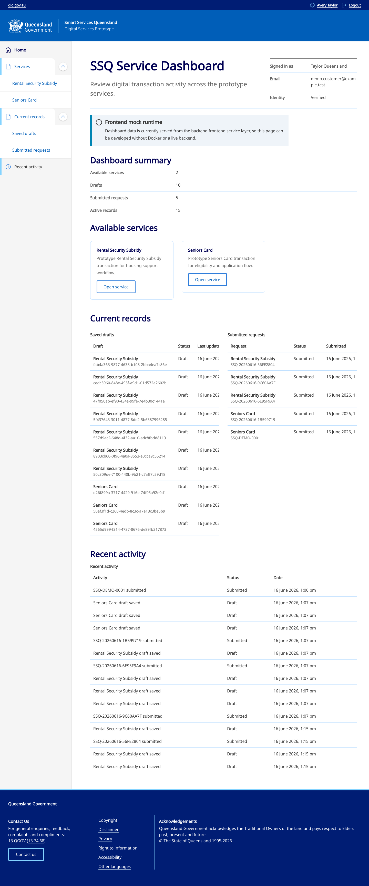
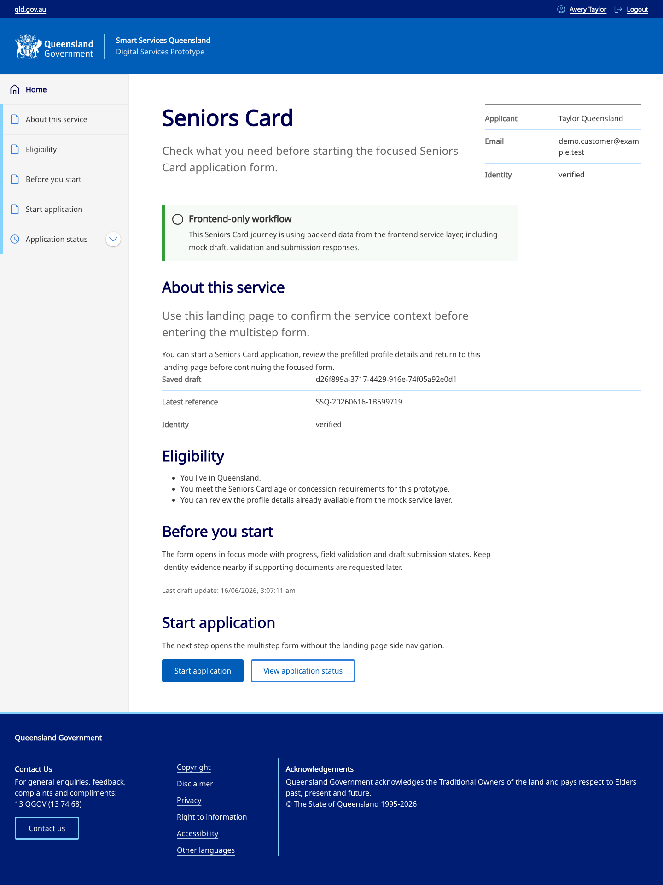
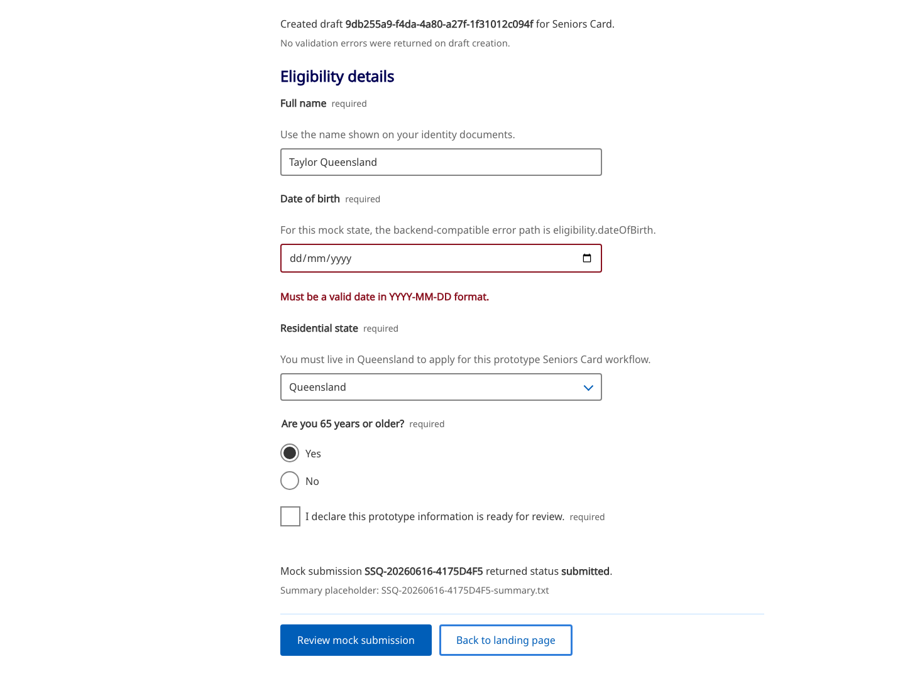
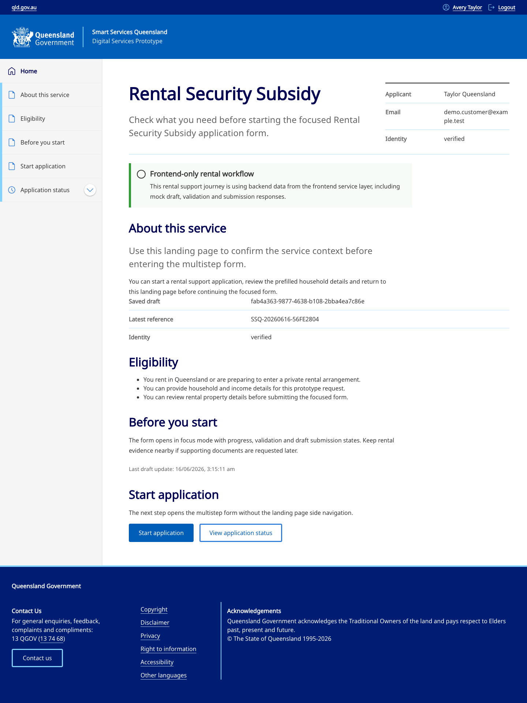

# SSQ Next.js + Node.js Prototype

Working prototype of a Smart Services Queensland-style digital transaction portal for myQLD service workflows.

The prototype shows three separately deployable Next.js frontend apps over a shared Node.js/Fastify backend, PostgreSQL persistence, backend-owned validation, service request lifecycle, supporting document metadata policy, review dashboard visibility, local Docker runtime, quality guards and DigitalOcean review deployment notes.

It is still a prototype boundary, not an official Queensland Government, Smart Service Queensland, myQLD or production Digital Transaction Platform system.

## Live Review

Current DigitalOcean review environment:

- Dashboard: https://ssq-dashboard-swgsm.ondigitalocean.app
- Seniors Card: https://ssq-seniors-card-lfzpt.ondigitalocean.app
- Rental Security Subsidy: https://ssq-rental-security-subsidy-kgbzf.ondigitalocean.app

The DigitalOcean deployment is a prototype review environment, not Queensland Government production infrastructure. The shared backend is configured server-side for the frontend apps; backend/admin/operations details are intentionally shared only through private reviewer notes.

## Screenshots

Captured from the live review apps on 2026-06-16.

| Service dashboard | Seniors Card application |
| --- | --- |
|  |  |

| Seniors Card apply flow | Rental Security Subsidy application |
| --- | --- |
|  |  |

## What Is Real

- Three separately deployable Next.js apps: dashboard, Seniors Card and Rental Security Subsidy.
- Shared Node.js/Fastify backend with GraphQL, REST health endpoints and PostgreSQL.
- SQL migrations and deterministic prototype seed data.
- Database-backed transaction catalogue, feature flags, drafts, submissions, activity logs, status lifecycle and outbox records.
- Backend-authoritative draft validation and submission flow.
- Metadata-only supporting document upload policy with type, size, category and ownership checks.
- Submission summary metadata and text download endpoint.
- Demo citizen/reviewer role boundaries for submitted-record review and status updates.
- Server-only frontend service layer that keeps backend origins out of browser code.
- Docker Compose local runtime for PostgreSQL, backend and the three frontend app containers.
- DigitalOcean App Platform review deployment for the three public frontend apps.
- Correlation IDs, safe REST errors, CORS allow-list configuration, local rate limiting, security headers and artifact/secret guards.

## What Is Simulated

- This is not an official government system and no real citizen data should be used.
- Identity is selected through prototype demo headers, not real SSO, IAM or production session management.
- Citizen, reviewer and transaction data is seeded demonstration data.
- Supporting document handling validates metadata only; it does not store binaries, scan malware or enforce retention.
- Submission summaries are plain text prototype downloads, not official receipts.
- Outbox events are persisted for review, but no production queue worker is attached.
- DigitalOcean is review infrastructure and a review database posture, not hardened production hosting.

## Tech Stack

- Frontend: Next.js 16, React 19, TypeScript, Sass, QHDS-style React wrappers, Vitest and Playwright.
- Backend: Node.js 22, Fastify 5, GraphQL Yoga, PostgreSQL, Zod, Pino and Vitest.
- Runtime: Docker, Docker Compose and DigitalOcean App Platform review deployment.
- Tooling: pnpm 10.18.3, workspace packages, quality guards and GitHub Actions.

## Run Locally

Run from the repository root.

```bash
pnpm install
pnpm docker:build
pnpm docker:up:backend
pnpm test:full-stack-smoke
pnpm docker:down
```

Local URLs:

- Backend API: `http://localhost:7001`
- Dashboard: `http://localhost:3000`
- Seniors Card: `http://localhost:3001`
- Rental Security Subsidy: `http://localhost:3002`

The full-stack smoke verifies backend readiness, all three frontend `/status` endpoints, GraphQL profile/catalogue reads and backend-rendered frontend pages. See [docs/local-development.md](docs/local-development.md) for alternate ports, frontend-only mock mode and Docker details.

## Frontend-Only Development

Use mock mode for fast UI work without Docker, PostgreSQL or the backend.

```bash
SSQ_FRONTEND_DATA_SOURCE=mock pnpm --filter @ssq/dashboard dev
SSQ_FRONTEND_DATA_SOURCE=mock pnpm --filter @ssq/seniors-card dev
SSQ_FRONTEND_DATA_SOURCE=mock pnpm --filter @ssq/rental-security-subsidy dev
```

Run the browser smoke suite for all three frontend apps in mock mode:

```bash
pnpm test:mock-smoke:all
```

## Main Checks

```bash
pnpm guard:artifacts
pnpm build
pnpm guard:browser-bundles
pnpm guard:frontend-source
pnpm check
```

The guard scripts fail when generated artifacts, local env files, local databases, reports, generated DigitalOcean specs, browser-visible backend origins or backend-only environment variable names are tracked or leaked.

## Key Docs

- [Release handover runbook](docs/release-runbook.md)
- [Live review links](docs/live-review-links.md)
- [Local development](docs/local-development.md)
- [Backend architecture](docs/backend-architecture.md)
- [Backend production readiness](docs/backend-production-readiness.md)
- [Frontend architecture](docs/frontend-architecture.md)
- [Frontend deployment readiness](docs/frontend-deployment-readiness.md)
- [DigitalOcean deployment](docs/digitalocean-deployment.md)
- [QHDS visual baselines](docs/qhds-visual-baselines.md)

## Production Next Steps

- Replace demo identity headers with real identity, session management, SSO/IAM and auditable authorization.
- Move from review database posture to production database operations, including backups, high availability, point-in-time restore, migration policy and credential rotation.
- Add private object storage, malware scanning, retention controls and privacy review for documents.
- Attach real queue publishing, retry policy, dead-letter handling and outbox processing.
- Add structured log shipping, metrics, tracing, alerting and operational runbooks.
- Complete security, privacy, accessibility, browser, performance and resilience review.
- Add custom domains, final TLS/certificate ownership, environment promotion controls and secret-management policy.
